# NF4反量化
# 实验平台
英伟达：GH200
沐曦：C500
摩尔线程：S5000

# 基准测试
配置bitsandbytes环境进行基准测试，对于下列形状的权重矩阵生成，调用bitsandbytes进行量化及反量化，记录反量化的结果文件及运行的时间。与后续的实现进行平均误差和最大误差的对比。bitsandbytes测试在英伟达GH200进行。后续对比时各平台核函数先预热5次，再执行100次求平均时间。
(256, 256)
(512, 512)
(1024, 1024)
(2048, 2048)
(4096, 4096)
(8192, 8192)
(16384, 16384)
(3421, 3146)
(6578, 1236)
(7000, 7000)
# python环境配置
```
conda create -n nf4 python=3.10 -y
pip install torch --index-url https://download.pytorch.org/whl/cu124
pip install bitsandbytes numpy pandas
conda install -c nvidia cuda-nvcc cuda-runtime cuda-cudart -y
cd 03_nf4_dequant/
python generate_and_benchmark_bnb.py #生成bitsandbytes基准进行对比
```
# 代码文件结构
因为权重文件存储太大，不上传到github中
Learning-CUDA
├── 03_nf4_dequant/ 
│ ├── bnb_results/ # bitsandbytes 解量化输出结果
│ ├── cuda_results/ # CUDA kernel 解量化输出结果
│ ├── musa_results/ # MUSA 平台解量化结果
│ ├── mx_results/ # MX 平台解量化结果
│ ├── mexc/ # 摩尔线程平台实现代码
│ ├── mx/ # 沐曦平台 kernel 实现
│ ├── nv/ # CUDA kernel 实现
│ ├── weight_data/ # NF4 量化后的权重测试数据
│ ├── generate_and_benchmark_bnb.py # 生成 NF4 测试数据并运行 bitsandbytes benchmark
│ ├── bnb_benchmark_results.csv # bitsandbytes benchmark 结果
│ ├── 总结报告.md # NF4 解量化实验总结
│ └── README.md 

# nf4反量化理论
```
NF4[qi​]×(code2[absmax_q[block_idx]​]×absmax2​+offset)
```
# 英伟达平台程序执行及性能分析
```sh
cd nv
./run_all.sh //对于程序进行编译和对于所有权重文件运行，生成结果文件及时间
python compare_results.py //进行性能和误差分析
```
# 英伟达优化思路
## nf4_dequant_v1:
基础nf4反量化，实现两级缩放的解量化，建立NF4查找表(NF4_LUT)，在计算中使用float进行计算,一个线程计算一个元素，NF4_LUT放入常量内存。每个线程一次处理两个 4-bit 索引，计算两个 BF16 值后打包成一个 32-bit uint32_t 一次性写入全局内存。
| Shape | Block | BnB (ms) | cuda (ms) | Speedup | MAE | Max Diff |
|-------|-------|----------|-----------|---------|-----|----------|
| 4096x4096 | 128 | 0.0905 | 0.0666 | 1.36 | 0.00002557 | 0.00390625 |
| 4096x4096 | 64 | 0.0891 | 0.0678 | 1.31 | 0.00001973 | 0.00390625 |
| 3421x3146 | 64 | 0.0925 | 0.0436 | 2.12 | 0.00001746 | 0.00390625 |
| 7000x7000 | 128 | 0.0939 | 0.1926 | 0.49 | 0.00001764 | 0.00390625 |
| 2048x2048 | 64 | 0.0910 | 0.0183 | 4.97 | 0.00003022 | 0.00390625 |
| 8192x8192 | 128 | 0.0912 | 0.3057 | 0.30 | 0.00002319 | 0.00390625 |
| 6578x1236 | 64 | 0.0895 | 0.0819 | 1.09 | 0.00003105 | 0.00390625 |
| 2048x2048 | 128 | 0.0925 | 0.0179 | 5.17 | 0.00001603 | 0.00390625 |
| 7000x7000 | 64 | 0.0909 | 0.2325 | 0.39 | 0.00002593 | 0.00390625 |
| 256x256 | 128 | 0.1064 | 0.0028 | 38.00 | 0.00002176 | 0.00195312 |
| 256x256 | 64 | 0.1144 | 0.0027 | 42.37 | 0.00003350 | 0.00390625 |
| 6578x1236 | 128 | 0.0876 | 0.0326 | 2.69 | 0.00001675 | 0.00390625 |
| 512x512 | 64 | 0.1010 | 0.0032 | 31.56 | 0.00001991 | 0.00195312 |
| 16384x16384 | 128 | 0.2973 | 1.6876 | 0.18 | 0.00002354 | 0.00390625 |
| 16384x16384 | 64 | 0.3074 | 1.7599 | 0.17 | 0.00002462 | 0.00390625 |
| 8192x8192 | 64 | 0.0918 | 0.3188 | 0.29 | 0.00001830 | 0.00390625 |
| 1024x1024 | 64 | 0.0960 | 0.0091 | 10.55 | 0.00001878 | 0.00390625 |
| 3421x3146 | 128 | 0.0904 | 0.0421 | 2.15 | 0.00001740 | 0.00390625 |
| 1024x1024 | 128 | 0.0912 | 0.0091 | 10.02 | 0.00001937 | 0.00390625 |
| 512x512 | 128 | 0.0977 | 0.0032 | 30.53 | 0.00001580 | 0.00195312 |
## nf4_dequant_v2
半精比float计算快，将中间的变量转化为半精执行。
| Shape | Block | BnB (ms) | cuda (ms) | Speedup | MAE | Max Diff |
|-------|-------|----------|-----------|---------|-----|----------|
| 4096x4096 | 128 | 0.0905 | 0.0670 | 1.35 | 0.00020349 | 0.00390625 |
| 4096x4096 | 64 | 0.0891 | 0.0681 | 1.31 | 0.00018179 | 0.00390625 |
| 3421x3146 | 64 | 0.0925 | 0.0437 | 2.12 | 0.00017142 | 0.00390625 |
| 7000x7000 | 128 | 0.0939 | 0.1929 | 0.49 | 0.00025988 | 0.00390625 |
| 2048x2048 | 64 | 0.0910 | 0.0185 | 4.92 | 0.00022352 | 0.00390625 |
| 8192x8192 | 128 | 0.0912 | 0.2631 | 0.35 | 0.00022542 | 0.00390625 |
| 6578x1236 | 64 | 0.0895 | 0.0335 | 2.67 | 0.00022066 | 0.00390625 |
| 2048x2048 | 128 | 0.0925 | 0.0181 | 5.11 | 0.00029397 | 0.00390625 |
| 7000x7000 | 64 | 0.0909 | 0.1984 | 0.46 | 0.00024140 | 0.00390625 |
| 256x256 | 128 | 0.1064 | 0.0027 | 39.41 | 0.00024271 | 0.00390625 |
| 256x256 | 64 | 0.1144 | 0.0027 | 42.37 | 0.00022900 | 0.00390625 |
| 6578x1236 | 128 | 0.0876 | 0.0328 | 2.67 | 0.00026894 | 0.00390625 |
| 512x512 | 64 | 0.1010 | 0.0033 | 30.61 | 0.00018466 | 0.00390625 |
| 16384x16384 | 128 | 0.2973 | 1.0421 | 0.29 | 0.00022352 | 0.00390625 |
| 16384x16384 | 64 | 0.3074 | 1.0718 | 0.29 | 0.00019693 | 0.00390625 |
| 8192x8192 | 64 | 0.0918 | 0.2703 | 0.34 | 0.00017440 | 0.00390625 |
| 1024x1024 | 64 | 0.0960 | 0.0066 | 14.55 | 0.00028801 | 0.00390625 |
| 3421x3146 | 128 | 0.0904 | 0.0426 | 2.12 | 0.00026965 | 0.00390625 |
| 1024x1024 | 128 | 0.0912 | 0.0065 | 14.03 | 0.00024605 | 0.00390625 |
| 512x512 | 128 | 0.0977 | 0.0032 | 30.53 | 0.00029063 | 0.00390625 |
## nf4_dequant_v3
NF4_LUT（NF4量化的查找表）每次都要从float转化为__half，在核函数启动前提前转化。
下面对8192x8192大小的反量化进行ncu分析，下面各个核函数都是对8192×8192的分析。
计算吞吐率达到90%，而内存吞吐只有10%左右。
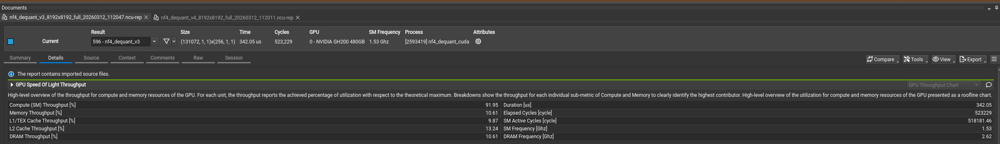
查看warp状态，Stall MIO Throtle占主要部分
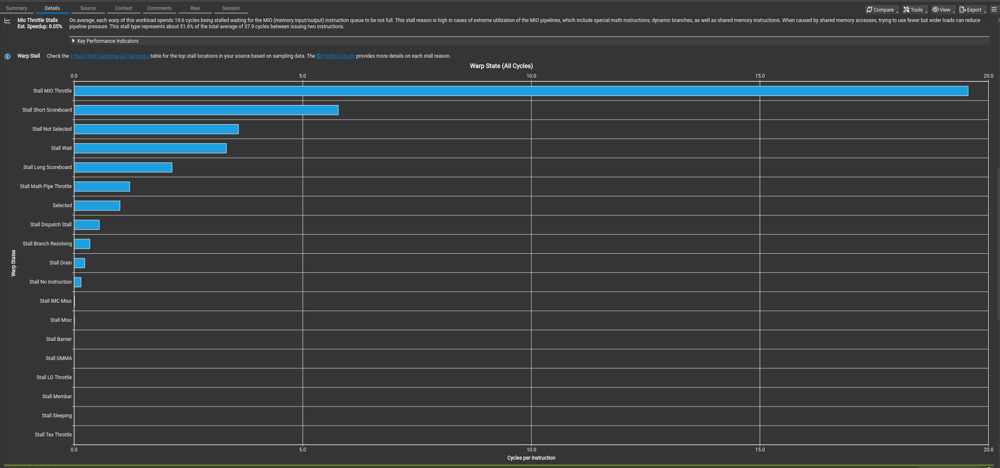
查找具体是下面两个地方对于内存的读取导致的
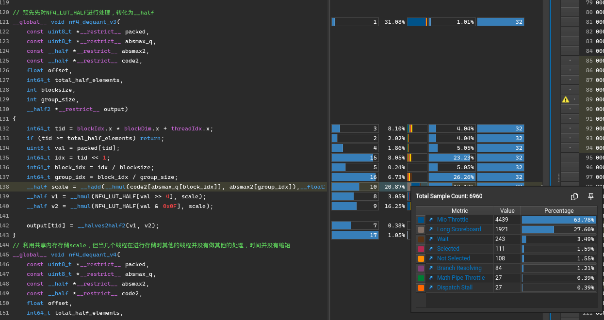
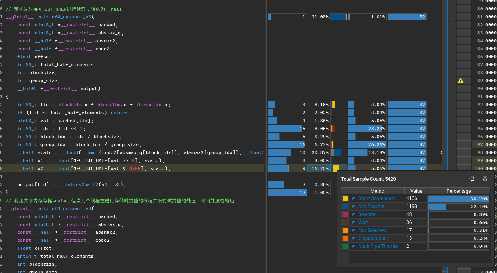
| Shape | Block | BnB (ms) | cuda (ms) | Speedup | MAE | Max Diff |
|-------|-------|----------|-----------|---------|-----|----------|
| 4096x4096 | 128 | 0.0905 | 0.0669 | 1.35 | 0.00020349 | 0.00390625 |
| 4096x4096 | 64 | 0.0891 | 0.0679 | 1.31 | 0.00018179 | 0.00390625 |
| 3421x3146 | 64 | 0.0925 | 0.0438 | 2.11 | 0.00017142 | 0.00390625 |
| 7000x7000 | 128 | 0.0939 | 0.1932 | 0.49 | 0.00025988 | 0.00390625 |
| 2048x2048 | 64 | 0.0910 | 0.0186 | 4.89 | 0.00022352 | 0.00390625 |
| 8192x8192 | 128 | 0.0912 | 0.2636 | 0.35 | 0.00022542 | 0.00390625 |
| 6578x1236 | 64 | 0.0895 | 0.0337 | 2.66 | 0.00022066 | 0.00390625 |
| 2048x2048 | 128 | 0.0925 | 0.0180 | 5.14 | 0.00029397 | 0.00390625 |
| 7000x7000 | 64 | 0.0909 | 0.1987 | 0.46 | 0.00024140 | 0.00390625 |
| 256x256 | 128 | 0.1064 | 0.0027 | 39.41 | 0.00024271 | 0.00390625 |
| 256x256 | 64 | 0.1144 | 0.0028 | 40.86 | 0.00022900 | 0.00390625 |
| 6578x1236 | 128 | 0.0876 | 0.0326 | 2.69 | 0.00026894 | 0.00390625 |
| 512x512 | 64 | 0.1010 | 0.0035 | 28.86 | 0.00018466 | 0.00390625 |
| 16384x16384 | 128 | 0.2973 | 1.0441 | 0.28 | 0.00022352 | 0.00390625 |
| 16384x16384 | 64 | 0.3074 | 1.0733 | 0.29 | 0.00019693 | 0.00390625 |
| 8192x8192 | 64 | 0.0918 | 0.2710 | 0.34 | 0.00017440 | 0.00390625 |
| 1024x1024 | 64 | 0.0960 | 0.0066 | 14.55 | 0.00028801 | 0.00390625 |
| 3421x3146 | 128 | 0.0904 | 0.0428 | 2.11 | 0.00026965 | 0.00390625 |
| 1024x1024 | 128 | 0.0912 | 0.0065 | 14.03 | 0.00024605 | 0.00390625 |
| 512x512 | 128 | 0.0977 | 0.0034 | 28.74 | 0.00029063 | 0.00390625 |
## nf4_dequant_v4
利用共享内存存储scale，但当几个线程在进行存储时其他的线程在等待，时间并没有缩短。
相比于v3，内存吞吐率更低了。
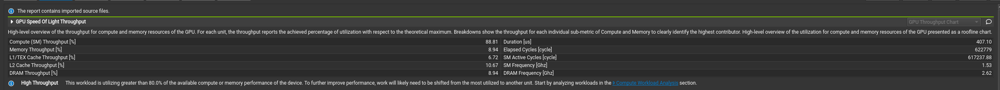
查看共享内存状态大量bank conflicts
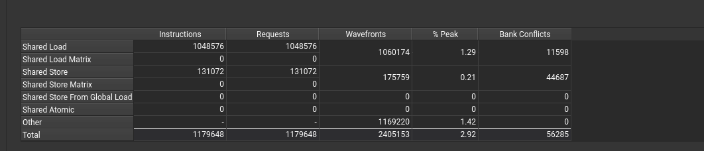
查看使用共享内存存在大量barrier
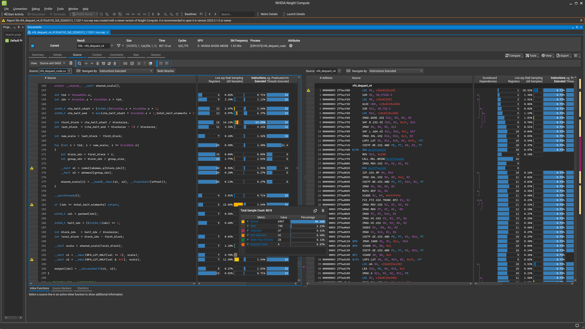
| Shape | Block | BnB (ms) | cuda (ms) | Speedup | MAE | Max Diff |
|-------|-------|----------|-----------|---------|-----|----------|
| 4096x4096 | 128 | 0.0905 | 0.0802 | 1.13 | 0.00020349 | 0.00390625 |
| 4096x4096 | 64 | 0.0891 | 0.0821 | 1.09 | 0.00018179 | 0.00390625 |
| 3421x3146 | 64 | 0.0925 | 0.0531 | 1.74 | 0.00017142 | 0.00390625 |
| 7000x7000 | 128 | 0.0939 | 0.2308 | 0.41 | 0.00025988 | 0.00390625 |
| 2048x2048 | 64 | 0.0910 | 0.0224 | 4.06 | 0.00022352 | 0.00390625 |
| 8192x8192 | 128 | 0.0912 | 0.3140 | 0.29 | 0.00022542 | 0.00390625 |
| 6578x1236 | 64 | 0.0895 | 0.0408 | 2.19 | 0.00022066 | 0.00390625 |
| 2048x2048 | 128 | 0.0925 | 0.0219 | 4.22 | 0.00029397 | 0.00390625 |
| 7000x7000 | 64 | 0.0909 | 0.2386 | 0.38 | 0.00024140 | 0.00390625 |
| 256x256 | 128 | 0.1064 | 0.0033 | 32.24 | 0.00024271 | 0.00390625 |
| 256x256 | 64 | 0.1144 | 0.0032 | 35.75 | 0.00022900 | 0.00390625 |
| 6578x1236 | 128 | 0.0876 | 0.0397 | 2.21 | 0.00026894 | 0.00390625 |
| 512x512 | 64 | 0.1010 | 0.0040 | 25.25 | 0.00018466 | 0.00390625 |
| 16384x16384 | 128 | 0.2973 | 1.2404 | 0.24 | 0.00022352 | 0.00390625 |
| 16384x16384 | 64 | 0.3074 | 1.2822 | 0.24 | 0.00019693 | 0.00390625 |
| 8192x8192 | 64 | 0.0918 | 0.3244 | 0.28 | 0.00017440 | 0.00390625 |
| 1024x1024 | 64 | 0.0960 | 0.0080 | 12.00 | 0.00028801 | 0.00390625 |
| 3421x3146 | 128 | 0.0904 | 0.0518 | 1.75 | 0.00026965 | 0.00390625 |
| 1024x1024 | 128 | 0.0912 | 0.0079 | 11.54 | 0.00024605 | 0.00390625 |
| 512x512 | 128 | 0.0977 | 0.0040 | 24.42 | 0.00029063 | 0.00390625 |
## nf4_dequant_v5
进行向量化读取，一个程序处理多个元素
现在的计算吞吐达到95%，但内存吞吐还是很低。
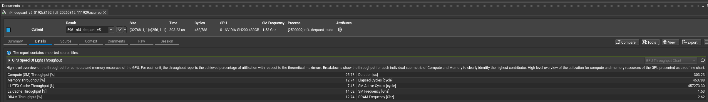
还是大量存在Stall MIO Throtle
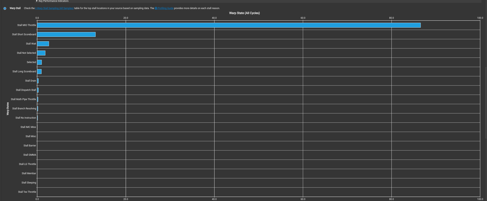
对于NF4_LUT还是有大量的Stall MIO Throtle，还有对于计算scale也有Stall MIO Throtle
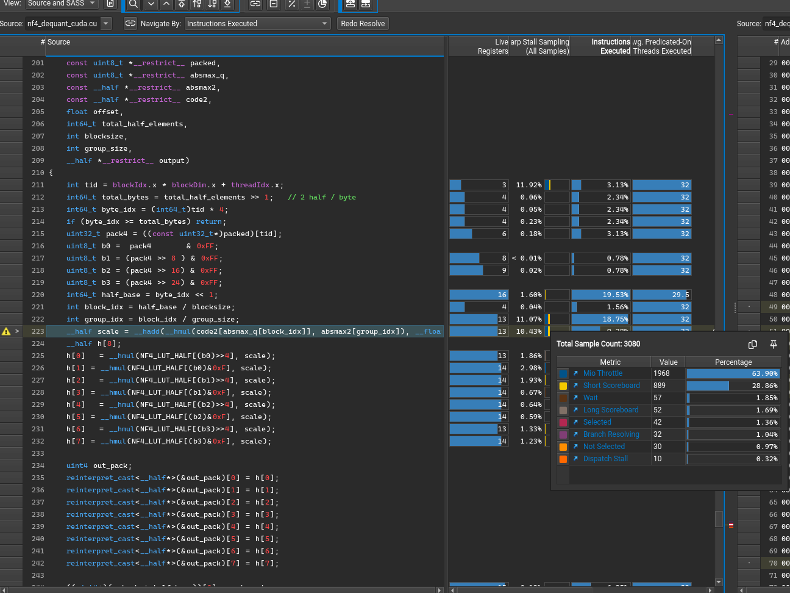
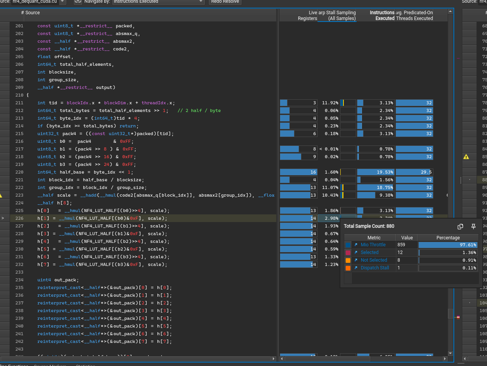
| Shape | Block | BnB (ms) | cuda (ms) | Speedup | MAE | Max Diff |
|-------|-------|----------|-----------|---------|-----|----------|
| 4096x4096 | 128 | 0.0905 | 0.0847 | 1.07 | 0.00020349 | 0.00390625 |
| 4096x4096 | 64 | 0.0891 | 0.0928 | 0.96 | 0.00018179 | 0.00390625 |
| 3421x3146 | 64 | 0.0925 | 0.0452 | 2.05 | 0.00017142 | 0.00390625 |
| 7000x7000 | 128 | 0.0939 | 0.3667 | 0.26 | 0.00025988 | 0.00390625 |
| 2048x2048 | 64 | 0.0910 | 0.0197 | 4.62 | 0.00022352 | 0.00390625 |
| 8192x8192 | 128 | 0.0912 | 0.2261 | 0.40 | 0.00022542 | 0.00390625 |
| 6578x1236 | 64 | 0.0895 | 0.0401 | 2.23 | 0.00022066 | 0.00390625 |
| 2048x2048 | 128 | 0.0925 | 0.0193 | 4.79 | 0.00029397 | 0.00390625 |
| 7000x7000 | 64 | 0.0909 | 0.1721 | 0.53 | 0.00024140 | 0.00390625 |
| 256x256 | 128 | 0.1064 | 0.0060 | 17.73 | 0.00024271 | 0.00390625 |
| 256x256 | 64 | 0.1144 | 0.0062 | 18.45 | 0.00022900 | 0.00390625 |
| 6578x1236 | 128 | 0.0876 | 0.0433 | 2.02 | 0.00026894 | 0.00390625 |
| 512x512 | 64 | 0.1010 | 0.0034 | 29.71 | 0.00018466 | 0.00390625 |
| 16384x16384 | 128 | 0.2973 | 1.4397 | 0.21 | 0.00022352 | 0.00390625 |
| 16384x16384 | 64 | 0.3074 | 1.0827 | 0.28 | 0.00019693 | 0.00390625 |
| 8192x8192 | 64 | 0.0918 | 0.2343 | 0.39 | 0.00017440 | 0.00390625 |
| 1024x1024 | 64 | 0.0960 | 0.0094 | 10.21 | 0.00028801 | 0.00390625 |
| 3421x3146 | 128 | 0.0904 | 0.0445 | 2.03 | 0.00026965 | 0.00390625 |
| 1024x1024 | 128 | 0.0912 | 0.0058 | 15.72 | 0.00024605 | 0.00390625 |
| 512x512 | 128 | 0.0977 | 0.0067 | 14.58 | 0.00029063 | 0.00390625 |
## nf4_dequant_v6：
将code也放入常量内存，减少从全局内存进行读取
现在的计算吞吐达到96%，但内存吞吐还是很低。
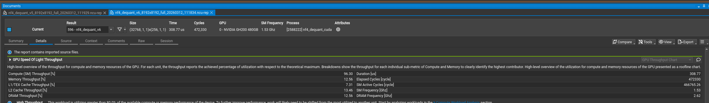
还是大量存在Stall MIO Throtle
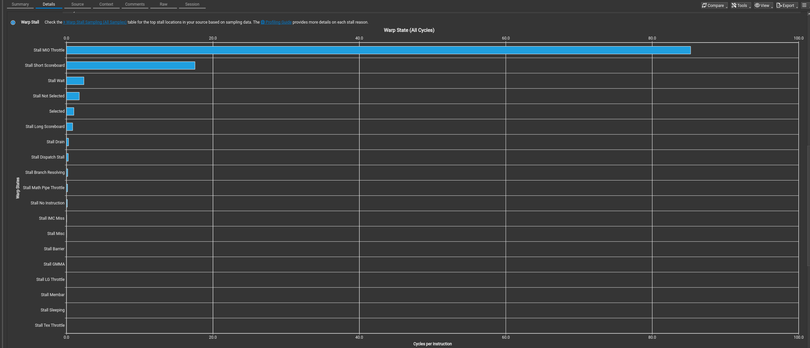
对于NF4_LUT还是有大量的Stall MIO Throtle，还有对于code2的Stall MIO Throtle有所减少。
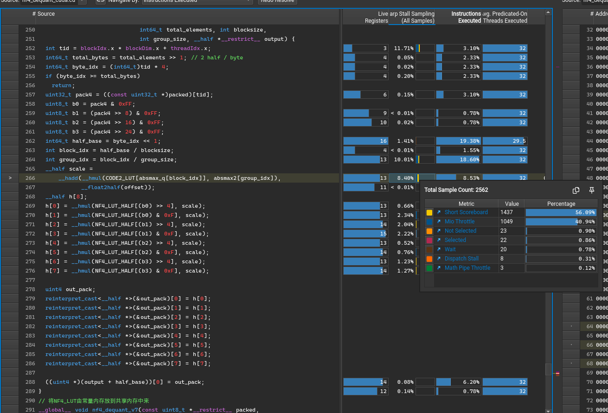
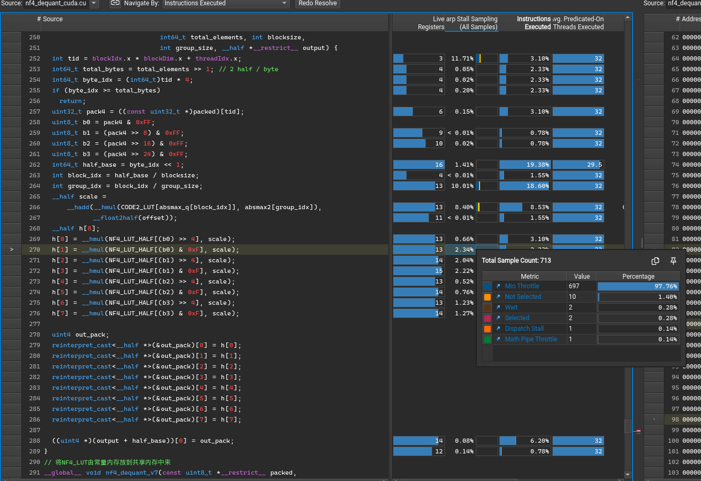
| Shape | Block | BnB (ms) | cuda (ms) | Speedup | MAE | Max Diff |
|-------|-------|----------|-----------|---------|-----|----------|
| 4096x4096 | 128 | 0.0905 | 0.0594 | 1.52 | 0.00020349 | 0.00390625 |
| 4096x4096 | 64 | 0.0891 | 0.0621 | 1.43 | 0.00018179 | 0.00390625 |
| 3421x3146 | 64 | 0.0925 | 0.0404 | 2.29 | 0.00017142 | 0.00390625 |
| 7000x7000 | 128 | 0.0939 | 0.1671 | 0.56 | 0.00025988 | 0.00390625 |
| 2048x2048 | 64 | 0.0910 | 0.0176 | 5.17 | 0.00022352 | 0.00390625 |
| 8192x8192 | 128 | 0.0912 | 0.2273 | 0.40 | 0.00022542 | 0.00390625 |
| 6578x1236 | 64 | 0.0895 | 0.0316 | 2.83 | 0.00022066 | 0.00390625 |
| 2048x2048 | 128 | 0.0925 | 0.0168 | 5.51 | 0.00029397 | 0.00390625 |
| 7000x7000 | 64 | 0.0909 | 0.1754 | 0.52 | 0.00024140 | 0.00390625 |
| 256x256 | 128 | 0.1064 | 0.0035 | 30.40 | 0.00024271 | 0.00390625 |
| 256x256 | 64 | 0.1144 | 0.0035 | 32.69 | 0.00022900 | 0.00390625 |
| 6578x1236 | 128 | 0.0876 | 0.0300 | 2.92 | 0.00026894 | 0.00390625 |
| 512x512 | 64 | 0.1010 | 0.0035 | 28.86 | 0.00018466 | 0.00390625 |
| 16384x16384 | 128 | 0.2973 | 0.8980 | 0.33 | 0.00022352 | 0.00390625 |
| 16384x16384 | 64 | 0.3074 | 0.9441 | 0.33 | 0.00019693 | 0.00390625 |
| 8192x8192 | 64 | 0.0918 | 0.2389 | 0.38 | 0.00017440 | 0.00390625 |
| 1024x1024 | 64 | 0.0960 | 0.0062 | 15.48 | 0.00028801 | 0.00390625 |
| 3421x3146 | 128 | 0.0904 | 0.0385 | 2.35 | 0.00026965 | 0.00390625 |
| 1024x1024 | 128 | 0.0912 | 0.0060 | 15.20 | 0.00024605 | 0.00390625 |
| 512x512 | 128 | 0.0977 | 0.0036 | 27.14 | 0.00029063 | 0.00390625 |
## nf4_dequant_v7：
将NF4_LUT由常量内存放到共享内存中来，速度比v6版本大大提高了

内存吞吐达到60%，且计算时间大大减少
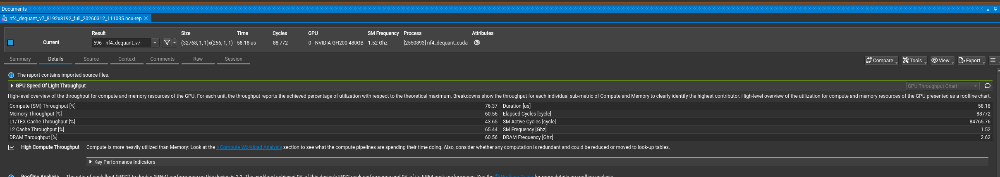
Stall MIO Throtle大大减少
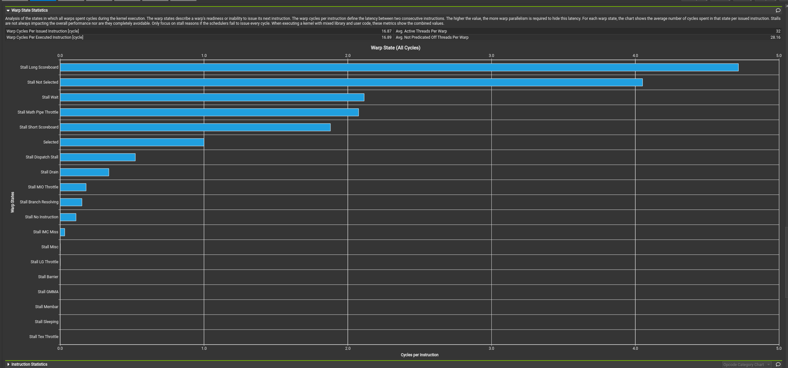
引入共享内存后出现bank conflicts
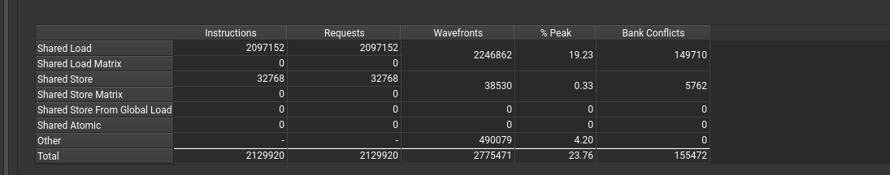
对于NF4_LUT已经计算scale的Stall MIO Throtle消失
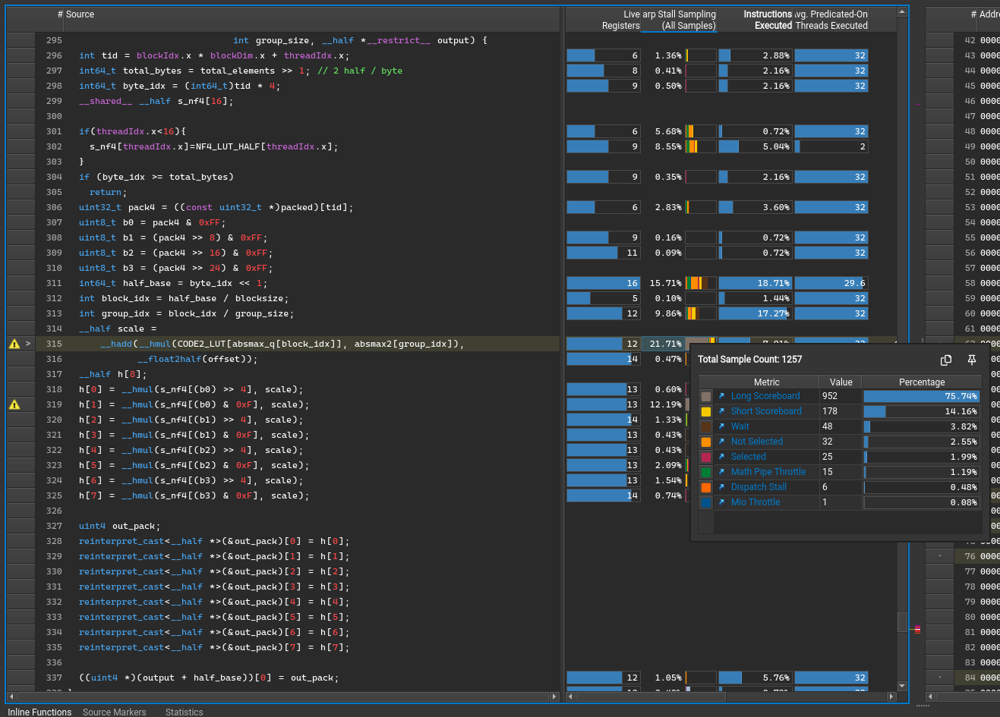
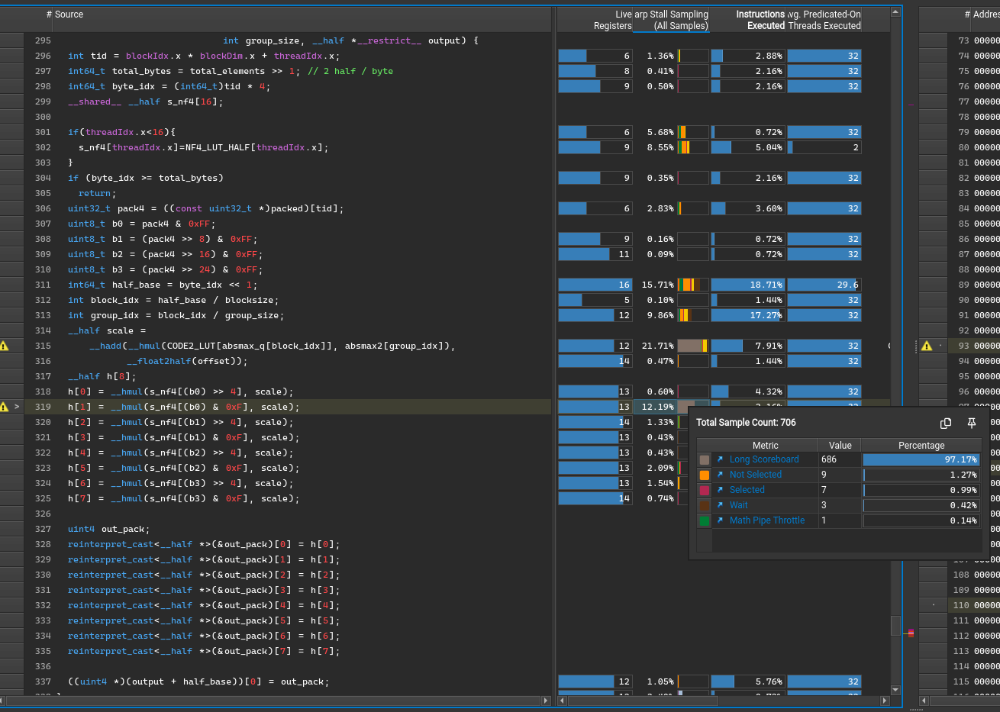
| Shape | Block | BnB (ms) | cuda (ms) | Speedup | MAE | Max Diff |
|-------|-------|----------|-----------|---------|-----|----------|
| 4096x4096 | 128 | 0.0905 | 0.0131 | 6.91 | 0.00020349 | 0.00390625 |
| 4096x4096 | 64 | 0.0891 | 0.0134 | 6.65 | 0.00018179 | 0.00390625 |
| 3421x3146 | 64 | 0.0925 | 0.0087 | 10.63 | 0.00017142 | 0.00390625 |
| 7000x7000 | 128 | 0.0939 | 0.0449 | 2.09 | 0.00025988 | 0.00390625 |
| 2048x2048 | 64 | 0.0910 | 0.0047 | 19.36 | 0.00022352 | 0.00390625 |
| 8192x8192 | 128 | 0.0912 | 0.0581 | 1.57 | 0.00022542 | 0.00390625 |
| 6578x1236 | 64 | 0.0895 | 0.0073 | 12.26 | 0.00022066 | 0.00390625 |
| 2048x2048 | 128 | 0.0925 | 0.0049 | 18.88 | 0.00029397 | 0.00390625 |
| 7000x7000 | 64 | 0.0909 | 0.0418 | 2.17 | 0.00024140 | 0.00390625 |
| 256x256 | 128 | 0.1064 | 0.0028 | 38.00 | 0.00024271 | 0.00390625 |
| 256x256 | 64 | 0.1144 | 0.0028 | 40.86 | 0.00022900 | 0.00390625 |
| 6578x1236 | 128 | 0.0876 | 0.0070 | 12.51 | 0.00026894 | 0.00390625 |
| 512x512 | 64 | 0.1010 | 0.0028 | 36.07 | 0.00018466 | 0.00390625 |
| 16384x16384 | 128 | 0.2973 | 0.2156 | 1.38 | 0.00022352 | 0.00390625 |
| 16384x16384 | 64 | 0.3074 | 0.2292 | 1.34 | 0.00019693 | 0.00390625 |
| 8192x8192 | 64 | 0.0918 | 0.0593 | 1.55 | 0.00017440 | 0.00390625 |
| 1024x1024 | 64 | 0.0960 | 0.0031 | 30.97 | 0.00028801 | 0.00390625 |
| 3421x3146 | 128 | 0.0904 | 0.0087 | 10.39 | 0.00026965 | 0.00390625 |
| 1024x1024 | 128 | 0.0912 | 0.0029 | 31.45 | 0.00024605 | 0.00390625 |
| 512x512 | 128 | 0.0977 | 0.0028 | 34.89 | 0.00029063 | 0.00390625 |
# 英伟达平台适配结果
对于GH200对nf4_dequant_v7进行支持。执行结果权重文件为cuda_results目录下的.fp16为后缀的文件，log文件记录带宽及其执行时间。加速比在nv/comparison_cuda_results.md
| Shape | Block | BnB (ms) | cuda (ms) | Speedup | MAE | Max Diff |
|-------|-------|----------|-----------|---------|-----|----------|
| 4096x4096 | 128 | 0.0905 | 0.0131 | 6.91 | 0.00020349 | 0.00390625 |
| 4096x4096 | 64 | 0.0891 | 0.0134 | 6.65 | 0.00018179 | 0.00390625 |
| 3421x3146 | 64 | 0.0925 | 0.0087 | 10.63 | 0.00017142 | 0.00390625 |
| 7000x7000 | 128 | 0.0939 | 0.0449 | 2.09 | 0.00025988 | 0.00390625 |
| 2048x2048 | 64 | 0.0910 | 0.0047 | 19.36 | 0.00022352 | 0.00390625 |
| 8192x8192 | 128 | 0.0912 | 0.0581 | 1.57 | 0.00022542 | 0.00390625 |
| 6578x1236 | 64 | 0.0895 | 0.0073 | 12.26 | 0.00022066 | 0.00390625 |
| 2048x2048 | 128 | 0.0925 | 0.0049 | 18.88 | 0.00029397 | 0.00390625 |
| 7000x7000 | 64 | 0.0909 | 0.0418 | 2.17 | 0.00024140 | 0.00390625 |
| 256x256 | 128 | 0.1064 | 0.0028 | 38.00 | 0.00024271 | 0.00390625 |
| 256x256 | 64 | 0.1144 | 0.0028 | 40.86 | 0.00022900 | 0.00390625 |
| 6578x1236 | 128 | 0.0876 | 0.0070 | 12.51 | 0.00026894 | 0.00390625 |
| 512x512 | 64 | 0.1010 | 0.0028 | 36.07 | 0.00018466 | 0.00390625 |
| 16384x16384 | 128 | 0.2973 | 0.2156 | 1.38 | 0.00022352 | 0.00390625 |
| 16384x16384 | 64 | 0.3074 | 0.2292 | 1.34 | 0.00019693 | 0.00390625 |
| 8192x8192 | 64 | 0.0918 | 0.0593 | 1.55 | 0.00017440 | 0.00390625 |
| 1024x1024 | 64 | 0.0960 | 0.0031 | 30.97 | 0.00028801 | 0.00390625 |
| 3421x3146 | 128 | 0.0904 | 0.0087 | 10.39 | 0.00026965 | 0.00390625 |
| 1024x1024 | 128 | 0.0912 | 0.0029 | 31.45 | 0.00024605 | 0.00390625 |
| 512x512 | 128 | 0.0977 | 0.0028 | 34.89 | 0.00029063 | 0.00390625 |
# 沐曦平台程序执行及性能分析
```sh
cd mx
./run_all.sh 对于程序进行编译和对于所有权重文件运行
python compare_results.py 进行性能和误差分析
```
# 沐曦适配结果
对于沐曦S5000平台对nf4_dequant_v7进行支持，在大矩阵的表现较差。执行结果权重文件为mx_results目录下的.fp16为后缀的文件，log文件记录带宽及其执行时间。加速比在mx/comparison_mx_results.md
| Shape | Block | BnB (ms) | MX (ms) | Speedup | MAE | Max Diff |
|-------|-------|----------|---------|---------|-----|----------|
| 1024x1024 | 128 | 0.0912 | 0.0248 | 3.68 | 0.00024605 | 0.00390625 |
| 1024x1024 | 64 | 0.0960 | 0.0169 | 5.68 | 0.00028801 | 0.00390625 |
| 16384x16384 | 128 | 0.2973 | 0.9282 | 0.32 | 0.00022352 | 0.00390625 |
| 16384x16384 | 64 | 0.3074 | 1.0106 | 0.30 | 0.00019693 | 0.00390625 |
| 2048x2048 | 128 | 0.0925 | 0.0325 | 2.85 | 0.00029397 | 0.00390625 |
| 2048x2048 | 64 | 0.0910 | 0.0281 | 3.24 | 0.00022352 | 0.00390625 |
| 256x256 | 128 | 0.1064 | 0.0093 | 11.44 | 0.00024271 | 0.00390625 |
| 256x256 | 64 | 0.1144 | 0.0094 | 12.17 | 0.00022900 | 0.00390625 |
| 3421x3146 | 128 | 0.0904 | 0.0509 | 1.78 | 0.00026965 | 0.00390625 |
| 3421x3146 | 64 | 0.0925 | 0.0517 | 1.79 | 0.00017142 | 0.00390625 |
| 4096x4096 | 128 | 0.0905 | 0.0813 | 1.11 | 0.00020349 | 0.00390625 |
| 4096x4096 | 64 | 0.0891 | 0.0735 | 1.21 | 0.00018179 | 0.00390625 |
| 512x512 | 128 | 0.0977 | 0.0154 | 6.34 | 0.00029063 | 0.00390625 |
| 512x512 | 64 | 0.1010 | 0.0154 | 6.56 | 0.00018466 | 0.00390625 |
| 6578x1236 | 128 | 0.0876 | 0.0402 | 2.18 | 0.00026894 | 0.00390625 |
| 6578x1236 | 64 | 0.0895 | 0.0485 | 1.85 | 0.00022066 | 0.00390625 |
| 7000x7000 | 128 | 0.0939 | 0.1881 | 0.50 | 0.00025988 | 0.00390625 |
| 7000x7000 | 64 | 0.0909 | 0.1905 | 0.48 | 0.00024140 | 0.00390625 |
| 8192x8192 | 128 | 0.0912 | 0.2358 | 0.39 | 0.00022542 | 0.00390625 |
| 8192x8192 | 64 | 0.0918 | 0.2625 | 0.35 | 0.00017440 | 0.00390625 |

# 摩尔线程程序执行及性能分析
```sh
cd mexc
// 进行编译
$MUSA_ROOT/bin/mcc -O3 -std=c++17 \
-I$MUSA_ROOT/include \
-L$MUSA_ROOT/lib \
-L/usr/lib/gcc/x86_64-linux-gnu/11 \
-lmusart -lstdc++ \
nf4_dequant_musa.mu -o nf4_musa
// 提交任务执行权重文件
sbatch test.sbatch
// 进行性能和误差分析
python compare_results.py 
```
# 摩尔线程适配结果
对于S5000对nf4_dequant_v7进行支持，在中大矩阵的表现差，且有效带宽在最大时也只有229GB/s。执行结果权重文件为mexc_results目录下的.fp16为后缀的文件，log文件记录带宽及其执行时间。加速比在mexc/comparison_musa_results.md
| Shape | Block | BnB (ms) | MUSA (ms) | Speedup | MAE | MSE | Max Diff |
|-------|-------|----------|-----------|---------|-----|-----|----------|
| 2048x2048 | 128 | 0.0925 | 0.0435 | 2.13 | 0.00029397 | 0.00000030 | 0.00390625 | 
| 512x512 | 64 | 0.1010 | 0.0080 | 12.62 | 0.00018466 | 0.00000018 | 0.00390625 | 
| 256x256 | 64 | 0.1144 | 0.0074 | 15.46 | 0.00022900 | 0.00000024 | 0.00390625 | 
| 3421x3146 | 64 | 0.0925 | 0.1168 | 0.79 | 0.00017142 | 0.00000012 | 0.00390625 | 
| 7000x7000 | 64 | 0.0909 | 0.5581 | 0.16 | 0.00024140 | 0.00000024 | 0.00390625 | 
| 7000x7000 | 128 | 0.0939 | 0.5360 | 0.18 | 0.00025988 | 0.00000024 | 0.00390625 | 
| 2048x2048 | 64 | 0.0910 | 0.0456 | 2.00 | 0.00022352 | 0.00000018 | 0.00390625 | 
| 6578x1236 | 128 | 0.0876 | 0.0832 | 1.05 | 0.00026894 | 0.00000024 | 0.00390625 | 
| 1024x1024 | 128 | 0.0912 | 0.0137 | 6.66 | 0.00024605 | 0.00000024 | 0.00390625 | 
| 256x256 | 128 | 0.1064 | 0.0077 | 13.82 | 0.00024271 | 0.00000024 | 0.00390625 | 
| 8192x8192 | 64 | 0.0918 | 0.7726 | 0.12 | 0.00017440 | 0.00000012 | 0.00390625 | 
| 4096x4096 | 64 | 0.0891 | 0.1832 | 0.49 | 0.00018179 | 0.00000018 | 0.00390625 | 
| 8192x8192 | 128 | 0.0912 | 0.7425 | 0.12 | 0.00022542 | 0.00000018 | 0.00390625 | 
| 1024x1024 | 64 | 0.0960 | 0.0145 | 6.62 | 0.00028801 | 0.00000030 | 0.00390625 | 
| 6578x1236 | 64 | 0.0895 | 0.0867 | 1.03 | 0.00022066 | 0.00000018 | 0.00390625 | 
| 16384x16384 | 64 | 0.3074 | 3.3083 | 0.09 | 0.00019693 | 0.00000018 | 0.00390625 | 
| 512x512 | 128 | 0.0977 | 0.0078 | 12.53 | 0.00029063 | 0.00000030 | 0.00390625 | 
| 4096x4096 | 128 | 0.0905 | 0.1756 | 0.52 | 0.00020349 | 0.00000018 | 0.00390625 | 
| 3421x3146 | 128 | 0.0904 | 0.1103 | 0.82 | 0.00026965 | 0.00000024 | 0.00390625 | 
| 16384x16384 | 128 | 0.2973 | 3.1883 | 0.09 | 0.00022352 | 0.00000018 | 0.00390625 | 

# 未来可继续提升的地方
解决v7版本存在的bank conflicts,v7版本在国产GPU上执行较差，找到原因解决。