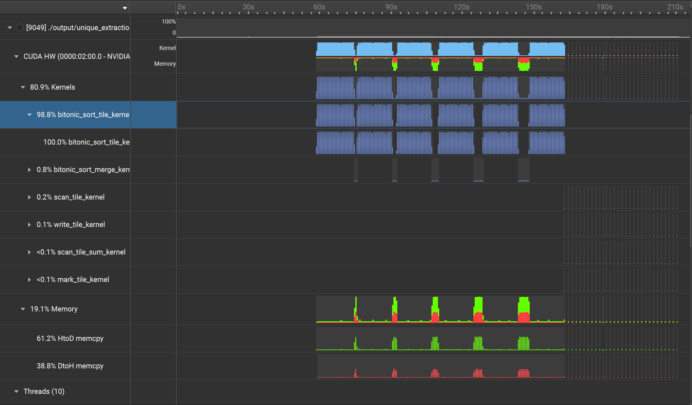
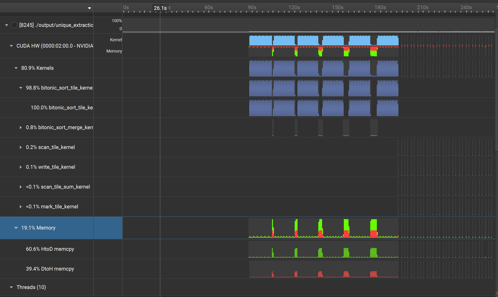
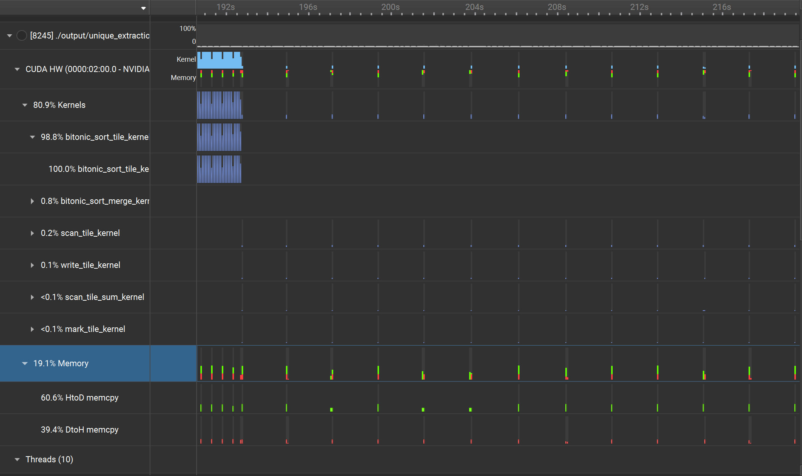

# InfiniTensor 大模型与人工智能系统训练营 CUDA 方向项目报告

- 选题： unique_extration(对大规模的 64 位特征值进行去重提取)
- 选题人： JBFYS-XD
- InfInfinitensor 主页： https://beta.infinitensor.com/user/jbfysxd
- Github 主页： https://github.com/JBFYS-XD

> 前言： 本蒟蒻的实现方式只能处理能完整加载到内存的数据量， 太菜导致的（

## 解题思路

去重通常有两种解法：

1. 使用 hash 表检测重复特征
2. 使用 sort 排序 + unique 进行去重

对于方法一， 特征量规模较大， hash 表并不能直接载入 GPU 中（会爆显存），如进行分表实现复杂（本蒟蒻太菜了， 甚至写不出一版做对比 (〒︿〒) ）；

反观方法二无论是 sort 操作还是 unique 操作在并行领域中都有高效简单的方法， 所以本蒟蒻决定用第二版解决此问题。

## 各部分解决方法

### sort 排序

假设 data_tile_size 是 GPU 所能容纳的最大数组长度（即 data_tile_size * 8B 的数据大小）, 对于每一个小于等于 data_tile_size 的小块能很轻易地进行排序， 所以主要难点在如何利用有限的显存将多个排好的块进行归并。

#### 归并排序
说到归并那第一个排序思路就是用归并排序， 对于每一对要归并的块案 data_tile_size 大小分步归并， 对每一对分出来的大小为 data_size (data_size <= data_tile_size) 的小块， 先用二分规划好在 block1 和 block2 分别所需要的元素数量（两个块所需的元素数量应该为 data_size）， 按需将这些元素加载到 GPU 中进行归并。

#### 双调排序
还有一种更简单的排序方法， 双调排序。 这个排序的特点是， 每一步中， 每一个元素只与特定位置的元素作比较操作， 且连续的元素所对应的操作数也一定连续且极好预测， 易于实现且内存合并和发散性也非常好，并行相性极好。

传统的双调函数需要满足元素数满足 $2^n$ 个数， 对于大规模数据如果进行补全的话极端情况会导致一倍的内存和时间开销， 但好在有任意长度的实现方式： [拜读大佬](https://zhuanlan.zhihu.com/p/707468542)

综上两种方法， 按性能来说归并排序是 $O(nlogn)$， 而双调排序是 $O(nlog^2n)$， 很明显应该选归并排序， 但是蒟蒻没吃透归并， 所以决定用双调排序实现 (能理解的吧， 对吧 ( ˘•ω•˘ ) )

### unique 去重
这一步就比较简单了， 因为进行过整体排序， 所以能够将全部特征进行分块去重

#### 步骤一 mark 打标记
标记当前位置的元素相较前面的元素是否是一个新的特征， $mark = data[pos] != data[pos - 1]$， 对于每一个块的第一个元素， 只需要记录前一个块的最后一个元素就行了， 或者他是全特质第一个， $first\_mark = global\_pos == 0$ $||$ $block[block\_pos - 1].back()$ $!=$ $block[block\_pos].first()$

#### 步骤二 scan 前缀和
对 marks 数组进行前缀和得到该位置的元素在去重后的数组的下标（下标从 1 开始）是多少

前缀和利用有名的 $Brent-Kung$ 算法进行扫描， 因涉及到同步所以需要多层操作， 每次操作只能对每个 BLOCKSIZE 大小的待操作数组进行单独扫描， 然后将每个扫描块的最后一个元素（也就是每个块的总和）作为待操作数进行下一层 scan， 最后再进行求和， 这样第 $i$ 层能操作的元素个数是 $BLOCKSIZE^i$ 个。

#### 步骤三 write 写回
这一操作就是以 scan 数组作为下标写入 result 数组（因 scan 数组第一个有效值应该是 1， 所以会写到 $result[scan[pos] - 1]$， 需要特别注意的是， 确实会有 $scan[pos] == 0$ 的情况， 那就是当前元素已被前一个块写过了， 即 $first\_mark == 0$ 的情况），result 数组就是一个去重成功的数组了。 

> 因为蒟蒻项目开始的较晚， 就没有图解进行详细讲解， 具体实现请看源代码， 请见谅 <(_ _)>

## 测试

### 测试环境
- 操作系统： Debian GNU/Linux 12 (bookworm)
- CPU 型号： Intel(R) Xeon(R) CPU E5-2673 v3 @ 2.40GHz
- GPU 型号： 	NVIDIA GeForce GTX 1060 5GB（没错是 10 系显卡， 导致后面测试没有 ncu (〒︿〒) ）
- NVIDIA 驱动版本: 535.247.01
- 测试数据： 500000000 个随机生成的 30(4.5GB)/64(9.5GB) 位特征量

### Nsight System 测试

对于测试数据的区别, 可以发现只会影响加载文件的速度， GPU 运行变化不大(毕竟都是以 uint64_t 存储)。

发现除去读写文件， 大部分时间花在了第一步 sort 环节， 且大部分都花在了 $bitonic_sort_tile_kernel$(这是对数组小于 data_tile_size 的小块进行的排序) 上面， 也就是说比归并排序多的 $logn$ 的时间复杂度发力了， 如果是 merge_sort 估计这部分时间会快很多， 这组数据估计快 6X 左右。

放大后面 unique 部分， 全花在写文件上了！ 实际 GPU 运行时间在 10ms * 30 左右。

## 改进

### 文件读写

文件读写应该可以用多核进行读写， 或者用 mmap 进行直接映射， 但可惜的是蒟蒻都不会， 这应该是改进最大的地方，用 mmap 甚至能改进本项目只能处理能完整加载到内存的数据量的局限性。

### sort 算法

如果归并算法替换双调排序应该又是一个巨大的提升

### kernel 内改进

因没有 ncu 所以对 kernel 的改进欠佳（实际也是这个原因选的第三个项目）， 但应该可以通过粗度和调整 data_tile_size 等参数进一步特化对 GPU 的适配， 对于 kernel 运行间穿插的 Host 与 Device 的数据加载， 可以用 cuda 流进行一定的延迟的隐藏。

## 结语

本次项目因某些原因 9.28 号才开始， 虽然之前也构思过， 但实际建库开始也是从 9.27 开始的， 所以完成度欠佳， 还望老师轻点锐评 <3。

> 完成时间： 2025.9.30 23:51